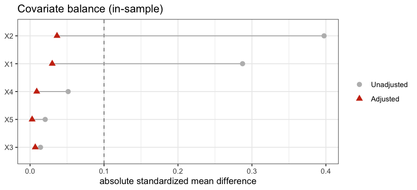
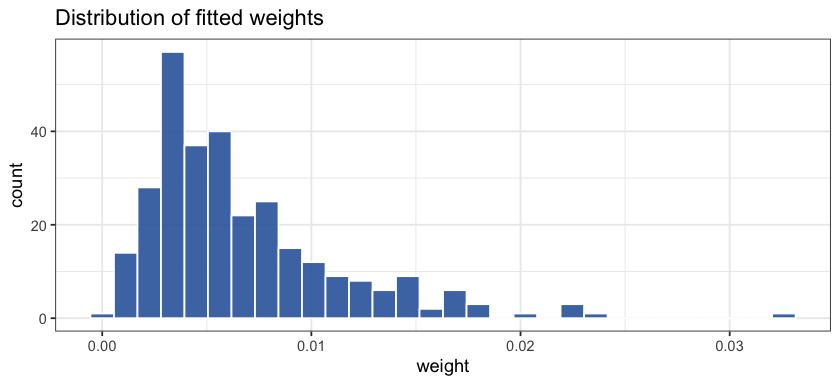

<!-- README.md is generated from README.Rmd. Please edit that file -->

<!-- badges: start -->

[](https://lifecycle.r-lib.org/articles/stages.html#experimental)
<!-- badges: end -->

# ebw

## Overview of `ebw`

The `ebw` package estimates covariate balancing weights for causal
inference by energy balancing, which reweights the covariate
distributions so that the treatment groups come to resemble a common
target distribution. Because energy balancing acts on the whole
distribution instead of a chosen set of moments, and a distribution
balanced in this sense is balanced in every moment at once, the
resulting weights tend to be robust to the way the outcome depends on
the covariates and can work quite well across a range of settings.

A single function, `energy_balance()`, covers three kinds of treatment.
For a binary treatment it returns the energy balancing weights of Huling
and Mak (2024); for a treatment with several categories it balances each
group to the pooled sample; and for a continuous treatment it returns
the independence weights of Huling, Greifer, and Chen (2024), which
reweight the sample toward independence between the treatment and the
covariates. An improved variant additionally balances the treatment
groups to one another.

Every fit records the ingredients of its dual representation, which
expresses each weight as an explicit function of the covariates.
Evaluating that function at a new covariate value gives the weight a
unit outside the fitted sample would receive, so `predict()` returns
out-of-sample weights without refitting. The package brings binary,
multi-category, and continuous treatments, together with out-of-sample
prediction, under one interface, and is intended to grow into a single
home for this family of methods, which have until now been split across
separate packages.

## Installing the `ebw` package

Install the development version from GitHub:

``` r
# install.packages("remotes")
remotes::install_github("jaredhuling/ebw")
```

The quadratic programs are solved with `osqp`, and the diagnostic plots
use `ggplot2`; both are installed automatically.

## Quick usage overview

### A binary treatment

Supply a covariate matrix and a treatment vector, or a formula and a
data frame. The two interfaces produce the same weights.

``` r
library(ebw)

set.seed(1)
n <- 300; p <- 5
X <- matrix(rnorm(n * p), n, p)
a <- rbinom(n, 1, plogis(X[, 1] - X[, 2]))

fit <- energy_balance(x = X, treatment = a, estimand = "ATE")
fit
#> Energy balancing / independence weights (class 'ebw')
#>   treatment type: binary 
#>   groups (K):     2 
#>   estimand:       ATE 
#>   kernel:         energy 
#>   scaling:        std 
#>   n:              300 
#>   ESS:            201.8  (67.3% of n)
#>   per-group ESS:  0=115.5, 1=89.6 
#>   weight range:   [0, 0.03259]
```

The covariates are standardized by default before the kernel is formed,
following the scaling conventions that make weighting methods behave
well when the covariates are measured on different scales. The `scaling`
argument controls this behavior.

### The improved estimator

Setting `improved = TRUE` adds a term that matches the weighted
treatment groups to one another as well as to the target, which reduces
the residual imbalance between the groups.

``` r
fit_improved <- energy_balance(x = X, treatment = a, improved = TRUE)
```

### A multi-category treatment

A treatment that is a factor, or that takes a small number of distinct
values, is balanced group by group to the pooled sample. Here the three
groups are assigned in a way that depends on the covariates, so that the
groups differ before weighting and there is imbalance to remove.

``` r
dat <- as.data.frame(X)
lp <- drop(X %*% c(1, -1, 0, 0, 0))
prob <- exp(cbind(-lp, 0, lp)); prob <- prob / rowSums(prob)
dat$A <- factor(
  c("low", "medium", "high")[apply(prob, 1, function(pr) sample(1:3, 1, prob = pr))],
  levels = c("low", "medium", "high"))

fit_multi <- energy_balance(A ~ ., data = dat)
```

`balance()` reports the energy distance of each group to the pooled
sample, which the weights reduce substantially, along with the
standardized mean differences and the between-group energy distances.

``` r
balance(fit_multi)
#> Balance diagnostics (in-sample)
#>   treatment type: multinomial 
#>   estimand:       ATE 
#>   groups:         3  
#>   per-group ESS:  low=45.7, medium=57.7, high=47.0 
#> 
#>   per covariate (standardized mean difference (SMD) vs pooled sample):
#>  variable  group unadjusted  adjusted
#>        V1    low    -0.4560 -0.065700
#>        V2    low     0.5810  0.091300
#>        V3    low    -0.0363 -0.003150
#>        V4    low     0.0123  0.016900
#>        V5    low     0.1150  0.004360
#>        V1 medium     0.0373  0.019800
#>        V2 medium     0.0128  0.019700
#>        V3 medium    -0.0384 -0.005450
#>        V4 medium     0.0259  0.012300
#>        V5 medium    -0.2350 -0.014900
#>        V1   high     0.4220  0.054600
#>        V2   high    -0.5730 -0.085500
#>        V3   high     0.0589  0.006270
#>        V4   high    -0.0279 -0.000948
#>        V5   high     0.0317  0.008950
#> 
#>   energy distance to pooled target (per group):
#>   group unadjusted adjusted
#>     low      0.430    0.153
#>  medium      0.195    0.123
#>    high      0.408    0.153
#> 
#>   between-group energy distance:
#>  group_j group_k unadjusted adjusted
#>      low  medium      0.511    0.199
#>      low    high      0.829    0.222
#>   medium    high      0.462    0.209
```

### A continuous treatment

A numeric treatment with many distinct values is handled by independence
weights, which drive the weighted distance covariance between the
treatment and the covariates toward zero while preserving the marginal
distributions.

``` r
A_cont <- drop(X %*% rep(0.2, p)) + rnorm(n)
fit_cont <- energy_balance(x = X, treatment = A_cont)
```

### Predicting weights out of sample

Because the fit carries its dual representation, the weight a new unit
would receive can be predicted from its covariates (and, for a discrete
or continuous treatment, its treatment value) without refitting.

``` r
Xnew <- matrix(rnorm(20 * p), 20, p)
anew <- rbinom(20, 1, 0.5)
w_new <- predict(fit, newdata = Xnew, treatment = anew)
summary(w_new)
#>    Min. 1st Qu.  Median    Mean 3rd Qu.    Max. 
#> 0.02488 0.22876 0.58409 0.65331 0.81623 1.84119
```

### Assessing balance and inspecting the weights

`balance()` reports the covariate balance the weights achieve, in the
fitted sample or, when `newdata` is supplied, in a fresh sample under
the predicted weights.

``` r
balance(fit)
#> Balance diagnostics (in-sample)
#>   treatment type: binary 
#>   estimand:       ATE 
#>   balanced group: 1 
#>   ESS:            89.6  (n = 139)
#> 
#>   per covariate (standardized mean difference (SMD)):
#>  variable unadjusted adjusted
#>        X1     0.2870  0.02990
#>        X2    -0.3980 -0.03640
#>        X3    -0.0141 -0.00703
#>        X4    -0.0515 -0.00901
#>        X5    -0.0205 -0.00277
#> 
#>   energy distance to target: unadjusted 0.2835, adjusted 0.08863
#> 
#>   between-group energy distance:
#>  group_j group_k unadjusted adjusted
#>        0       1      0.528    0.136
```

`plot()` draws a Love plot of the balance and, with `type = "weights"`,
a summary of the weight distribution.

``` r
plot(fit)
```



``` r
plot(fit, type = "weights")
```



The weights returned by `weights()` are a plain numeric vector, so they
pass directly to downstream tools such as `cobalt::bal.tab()` for
further balance assessment.

## Accessing help files for the main functions

``` r
?energy_balance       # fit weights for binary, multi-category, or continuous treatments
?predict.ebw          # out-of-sample weight prediction from the dual representation
?balance              # in-sample and out-of-sample balance diagnostics
?independence_weights # continuous-treatment interface compatible with independenceWeights
```

## References

Huling, J. D. and Mak, S. (2024). Energy balancing of covariate
distributions. *Journal of Causal Inference*, 12(1):20220029.

Huling, J. D., Greifer, N., and Chen, G. (2024). Independence weights
for causal inference with continuous treatments. *Journal of the
American Statistical Association*, 119(546):1657–1670.
